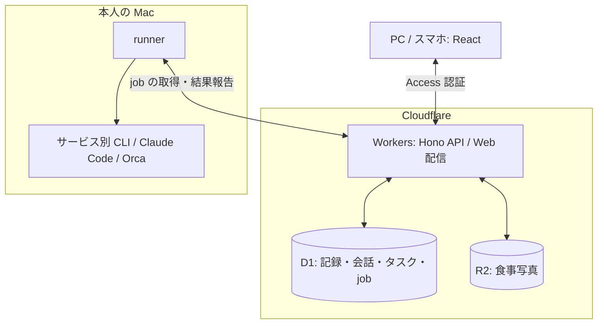

# Life Console

仕事の連絡とタスク、体重と食事、収支と資産をまとめた、自分用の Web アプリ。

## 仕事

Slack・Chatwork・Gmail・Talknote の連絡を集め、返信や作業が必要なものを整理します。会話から返信案を作り、タスクにしたものは作業リポジトリと紐づけて Codex / Claude Code へ渡せます。

- 返信案は会話履歴と本人の返信状況を踏まえて生成。Gmail と同じアカウントのメインカレンダーから日程候補を提案
- 下書きは本人が確認・編集。Slack / Chatwork はアプリから送信でき、Gmail / Talknote はコピーして元のサービスで送信
- coding agent は Orca 経由で既存の checkout または新しい worktree に起動
- GitHub で追跡したいタスクは Issue・非公開 Project へ昇格

タスクの管理元は Life Console。GitHub への昇格は一方向で、agent の作業環境は Mac に残ります。

## 健康と家計

| 対象 | 記録・振り返り |
| --- | --- |
| 体重 | 実測値と 7 日移動平均、目標への進捗。過去の CSV 取り込みと Obsidian への書き出し |
| 食事 | 写真とメモによる記録。カロリー・栄養素の自動推定は未実装 |
| 家計 | 月ごとの収支、カテゴリ別・支払手段別の支出、資産配分と純資産の推移。手入力と CSV 取り込み |

スマホのホーム画面に追加して使えます。Android には体重・食事の入力を直接開くウィジェットもあります。

## 構成

記録と写真の保存は Cloudflare で完結するため、Mac が止まっていても使えます。外部サービスとの同期や AI の実行は Mac の runner が担当し、各サービスの資格情報をローカルに保持します。

同期・送信・agent 起動は job として処理し、実行経過と結果を Web で確認できます。定期実行は D1 のスケジュールと Cloudflare Cron で管理。runner や外部 CLI の異常・復旧は Web Push で通知します。

## ライセンス

[MIT License](LICENSE)
