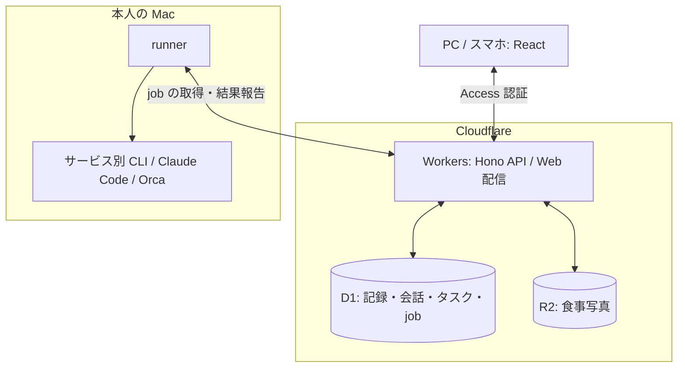

# Life Console

仕事の連絡とタスク、体重と食事、収支と資産をまとめた、自分用の Web アプリ。

## 仕事

Slack・Chatwork・Gmail・Talknote の連絡を集め、返信や作業が必要なものを整理します。会話から返信案を作り、タスクにしたものは作業リポジトリと紐づけて Codex / Claude Code へ渡せます。

- 返信案は会話履歴と本人の返信状況を踏まえて生成。Gmail と同じアカウントのメインカレンダーから日程候補を提案
- 下書きは本人が確認・編集。Slack / Chatwork はアプリから送信でき、Gmail / Talknote はコピーして元のサービスで送信
- coding agent は Orca 経由で既存の checkout または新しい worktree に起動
- GitHub で追跡したいタスクは Issue・非公開 Project へ昇格

タスクの管理元は Life Console。GitHub への昇格は一方向で、agent の作業環境は Mac に残ります。

## 健康と家計

| 対象 | 記録・振り返り |
| --- | --- |
| 体重 | 実測値と 7 日移動平均、目標への進捗。過去の CSV 取り込みと Obsidian への書き出し |
| 運動 | [Strava の本人用連携](docs/strava-integration.md)。週の走行距離・回数・時間を体重・食事と同じ期間で振り返る |
| 食事 | 写真とメモ、任意のカロリー入力による記録。未入力なら runner で推定し、食事ごとと日別の合計を表示 |
| 家計 | 月ごとの収支、カテゴリ別・支払手段別の支出、資産配分と純資産の推移。手入力と CSV 取り込み |

スマホのホーム画面に追加して使えます。Android には体重・食事の入力を直接開くウィジェットもあります。

## 構成

記録と写真の保存は Cloudflare で完結するため、Mac が止まっていても使えます。外部サービスとの同期や AI の実行は Mac の runner が担当し、各サービスの資格情報をローカルに保持します。

同期・送信・agent 起動は job として処理し、実行経過と結果を Web で確認できます。定期実行は D1 のスケジュールと Cloudflare Cron で管理。runner や外部 CLI の異常・復旧は Web Push で通知します。

## ライセンス

[MIT License](LICENSE)

## 食事写真のカロリー解析

初回の食事登録でカロリーを手入力できます。一覧の写真を押して開く詳細画面からも変更できます。手入力したカロリーを優先し、画像解析の自動予約・一括解析・再解析の対象から除外します。先に予約した個別解析は中止し、実行中なら中止を要求します。手入力と競合した解析結果は保存せず、一括解析の残りは続けます。

カロリーが未入力の写真付き食事を保存すると、その食事の解析ジョブを自動予約します。保存と予約は同じトランザクションで行い、保存リクエストの再送では重複予約しません。Mac の runner が次回のポーリング（既定 60 秒、先行ジョブがあればその後）で処理します。既存の未解析写真は『未解析の食事をまとめて解析』から処理できます。Mac の runner が停止中ならジョブは待機し、起動後に実行します。結果は画面へ自動反映され、再解析もできます。

runner の `LIFE_CONSOLE_NUTRITION_PROVIDER=codex|claude|gemini` で画像解析だけを切り替えます（既定 `codex`）。変更後は runner を再起動します。`LIFE_CONSOLE_NUTRITION_MODEL` で各 CLI のモデル名も指定できます。Codex の既定は画像入力に対応する低コスト向けの `gpt-5.6-luna`、推論は `low` です。ジョブを実行する時点の設定を使い、他の provider へ自動的に切り替えることはありません。返信生成や coding agent の選択には影響しません。

いずれも Mac の認証済み CLI からサービスへ写真とメモを送り、推論はクラウド側で行います。Codex は `codex login` で認証し、`codex exec --image` と JSON Schema で推定します。ユーザー設定・作業指示・スキル指示・メモリの取り込みを止め、shell・web 検索・連携アプリ・プラグイン・フックを無効にした読み取り専用の実行にします。会話を保存しない `--ephemeral` を使い、画像と結果の一時ファイルは終了時に削除します。保存するモデル名は CLI に指定した ID です。モデルの対応状況は [OpenAI Docs](https://learn.chatgpt.com/docs/models)、モデルの特徴は [Luna の仕様](https://developers.openai.com/api/docs/models/gpt-5.6-luna)で確認できます。

Claude は画像入力を `stream-json` で渡し、ツール・MCP・カスタマイズ・セッション保存を無効にします。Gemini は runner の環境へ `GEMINI_API_KEY` を設定すると API キー認証を使います。キーが未設定なら `gemini` コマンドで認証済みの Google ログインを使います。Gemini CLI の個人アカウント向け提供は [2026-06-18 に終了](https://developers.googleblog.com/an-important-update-transitioning-gemini-cli-to-antigravity-cli/)しており、ローカルの Google ログインも `UNSUPPORTED_CLIENT` で拒否されました。Gemini の実推定は未確認です。[公式の認証手順](https://geminicli.com/docs/get-started/authentication/)に従って利用可能な認証を用意してください。Google ログイン時は OAuth 認証ファイルだけを共有する専用の一時ディレクトリを使い、ツール・MCP・拡張・スキル・フックを無効にして、画像・メモ・実行履歴は終了時に削除します。通常は `~/.gemini` の認証を使い、`GEMINI_CLI_HOME` を設定している場合はその配下の `.gemini` を使います。

推定値は元の記録と別の既存 `nutrition_estimates` テーブルに保存し、使用モデル、解析日時、画像とメモの入力 hash を記録します。再解析の履歴を残し、手入力がなければ、一覧と日別集計には最新の結果だけを使います。日別合計は日本時間で画面の選択期間内の全記録を集計し、カロリー未記録を 0 kcal として扱わず、手入力・解析済みの記録件数を表示します。手入力の 0 kcal は記録済みです。メモのみの記録は画像解析の対象外です。

既存のスケジュール API で `jobKind: "nutrition_analysis"`、`interval: "daily"`、`payload: {}` を登録すると、未解析写真を定期処理できます。この変更だけでは本番のスケジュールは追加しません。
