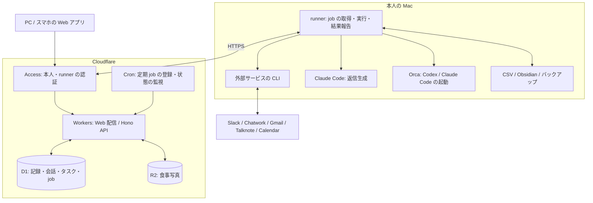

# Life Console

仕事の連絡とタスク、体重と食事、収支と資産を一か所で扱う、本人用のダッシュボードです。届いた会話から返信案を作り、作業が必要ならタスクにして、ローカルの Codex / Claude Code へ渡せます。日々の記録はスマホから入力し、推移や実行結果は同じ Web アプリで確認します。

利用者は本人 1 人を想定しています。コードを公開し、会話・生活記録・写真・資格情報は非公開で管理します。

## 何ができるか

| 画面 | できること |
| --- | --- |
| ホーム | 対応するタスク、未処理の会話、収支・純資産、最新の体重と推移を確認。タスク・食事・体重・支出・メモの入力へ進む |
| 仕事 | 複数サービスの会話を整理し、返信下書きやタスクを作成。タスクの期限・状態・作業リポジトリを管理し、agent 起動や GitHub への昇格を依頼する |
| 健康 | 体重・目標・食事を記録。実測値と 7 日移動平均、目標への進捗、食事の写真とメモを見返す |
| お金 | 収入・支出・残高を記録。月ごとの収支、カテゴリ別・支払手段別の支出、資産配分と純資産の推移を確認する |
| 同期・実行状況 | 同期と agent の実行経過、失敗理由、runner・外部 CLI の接続状態を確認。手動同期、中止要求、端末への通知設定を行う |

### 会話を取り込み、対応する

『仕事』の受信箱に連絡を集め、サービス・期間・対応状況で絞り込みます。会話を選ぶと、取り込んだ本文の抜粋、返信案、関連タスク、実行経過をまとめて確認できます。元のサービスを開くリンクも保持します。

| 連携先 | 取り込む内容 | Mac で使う CLI |
| --- | --- | --- |
| Slack | 本人へのメンション。既定は直近 7 日 | `sl` |
| Chatwork | 本人への To / 返信と未完了タスク | `cw` |
| Gmail | 受信トレイのメインカテゴリ。既定は直近 7 日 | `gog` |
| Talknote | DM と参加ノートの投稿・コメント | `tn` |

会話は『タスクにする』『参考情報にする』『対応不要にする』で整理できます。タスクにすると元の会話とのつながりが残り、タスク側から本文や返信案に戻れます。

### 返信下書き

個別の会話、またはサービスと期間を指定した未返信の会話に対して、Claude Code で返信案を作れます。生成時には CLI で会話履歴を再取得し、本人の返信履歴も照合します。返信済み・返信不要と判定した会話は通常の一覧から外れ、不明点や本人の判断が必要な内容は、本文とは別の確認事項として残ります。

下書きはアプリ内で編集・保存・コピーできます。手動編集した本文は再生成で上書きしません。生成には会話本文をモデルへ渡しますが、この操作だけで送信や Gmail 下書きの作成は行いません。

Slack / Chatwork は送信内容を確認してから、アプリ内で送信を依頼できます。Gmail / Talknote は本文をコピーして元のサービスで送信します。送信結果が不明になった場合は『結果不明』として残し、自動再送しません。

日程調整では、個別の会話で『カレンダーの空き時間を使う』を選ぶと、指定した期間・時間帯・所要時間に合う候補を返信案へ含められます。参照するのは Gmail と同じアカウントのメインカレンダーです。他のカレンダー・祝日・移動時間・相手の予定は確認対象に含まず、予定の予約や招待への承諾も行いません。

### タスクから coding agent へ渡す

タスクにはタイトル・説明・期限・状態・作業リポジトリを設定できます。Slack のチャンネル、Chatwork のルームとリポジトリの対応も保存でき、会話から作ったタスクの作業先に使います。

作業リポジトリを設定したタスクでは、Codex / Claude Code と作業場所を選んで起動を依頼できます。作業場所は新しい worktree または既存の main checkout です。Mac の runner が Orca を通して agent を起動し、タスクのタイトルと説明を渡します。結果はタスクに紐づく job として確認でき、作業後も worktree・terminal・session は残ります。

GitHub で追跡したいタスクは、Issue の作成や非公開 Project への追加を依頼できます。タスク管理の基準は Life Console に置き、GitHub への昇格は一方向です。GitHub 側の変更をタスクへ書き戻す双方向同期は行いません。

### 体重と食事を記録する

体重は日時と実測値を入力し、目標体重・目標日と合わせて管理します。グラフは 30 日・直近 90 日・年別・全期間で切り替えられ、拡大・移動や表での確認にも対応します。7 日移動平均は当日を含む直近 7 暦日の実測値から計算し、記録のない日は補間しません。

過去の体重は CSV から取り込めます。Obsidian への書き出しを設定すると、DB にある日の値を優先し、CSV にだけ残る過去分を保ちながら体重グラフ用データを更新します。

食事は朝食・昼食・夕食・間食に分けて、日時・写真・メモを記録します。写真のないメモだけの記録も可能です。一覧から記録を選ぶと写真とメモを開けます。現在は記録と閲覧に対応しており、写真からのカロリー・栄養素の自動推定は未実装です。

### 収支と資産を把握する

収入・支出には金額、カテゴリ、支払手段、支払先、日時を記録します。月を選ぶと収支と支出の内訳を確認でき、家計 CSV の取り込みにも対応します。取込元の金額を補正するときは、元の取引を残して差額と理由を別レコードに保存します。

残高は口座名と時点を指定し、現金・金融資産・負債に分けて記録します。各口座の残高から資産配分と純資産を集計し、推移をグラフで表示します。

### スマホから記録し、異常を通知で知る

Web アプリはスマホでも使え、ホーム画面への追加に対応しています。Android には体重・食事の入力画面を直接開く [ウィジェット](clients/android/README.md) もあります。利用にはネットワーク接続と Cloudflare Access へのログインが必要です。

『同期・実行状況』では runner と外部 CLI の状態・履歴を確認できます。端末ごとに Web Push を有効にすると、異常・未復旧・復旧の通知が届きます。CLI の接続状態と各同期 job の成否は別々に確認できます。

## どう動いているか

Web は React の SPA で、画面遷移に TanStack Router、API データの取得・更新に TanStack Query を使います。Hono API と同じ Cloudflare Worker から配信し、記録は D1、食事写真は非公開の R2 に保存します。

体重・食事・収支・タスクなどの入力と写真の保存は、Web から Cloudflare へ直接行います。Mac が停止していても、これらの記録と保存済みデータの閲覧は続けられます。

外部サービスとの同期、返信生成、coding agent の起動、ローカルの CSV・Obsidian との連携は Mac の runner が担当します。各サービスの CLI の資格情報を Mac に置いたまま処理し、取得した会話や生成結果を API 経由で D1 に保存します。agent の作業環境と詳細ログはローカルに残し、Web では job の状態と結果要約を扱います。

### 非同期処理と定期実行

画面からの同期・送信・agent 起動の依頼は、まず D1 に job として保存されます。定期処理も D1 のスケジュールを基準に Cloudflare Cron が job を登録し、runner が API を定期的に確認して実行します。スケジュールの登録は API から行います。

実行中の job は期限付きの実行権（lease）と heartbeat で管理します。agent の完了は明示的な結果報告で確定し、プロセス終了や idle だけでは成功にしません。agent 起動・GitHub 昇格・返信送信が実行途中で追跡不能になった場合は `lost` として残し、重複実行を避けるため自動でやり直しません。

バックアップ job は D1 の SQL dump と R2 の写真を Mac へ保存します。runner の応答や外部 CLI の認証・接続も監視対象ですが、Cloudflare 自体の停止を検知する外部監視はありません。

## コードと資料の入口

| 場所 | 役割 |
| --- | --- |
| [apps/web](apps/web/README.md) | 画面・共通 UI・Storybook |
| [apps/api](apps/api/src/app.ts) | Hono の HTTP API。入力の検証、業務処理、D1 / R2 への保存 |
| [apps/runner](apps/runner/src/usecases/job-executor-usecase.ts) | Mac 上での外部 CLI・agent・ファイル連携の実行 |
| [packages/contracts](packages/contracts/src) | Web・API・runner が共有する Zod schema と型 |
| [packages/db](packages/db/README.md) | Drizzle のテーブル定義、D1 migration、架空 seed |
| [packages/core](packages/core/README.md) / [packages/env](packages/env/README.md) | Result・logger と環境変数の共通定義 |
| [clients/android](clients/android/README.md) | 体重・食事の入力を開く Android ウィジェット |

実行コマンドは [package.json](package.json)、連携設定は [runner の設定例](apps/runner/.env.example)、CI・デプロイは [.github](.github/README.md) を参照してください。

- [運用上の注意](docs/operations.md): 配置・runner の接続、外部サービスの認証、通知の前提
- [体重の Obsidian 書き出し](docs/weight-obsidian-export.md)
- [要件定義](docs/requirements.md): 目的と記録済みの要件。未実装の計画を含む
- [開発ルール](AGENTS.md) / [AI 設定](docs/agent-configuration.md) / [ESLint](packages/eslint-config/README.md)
