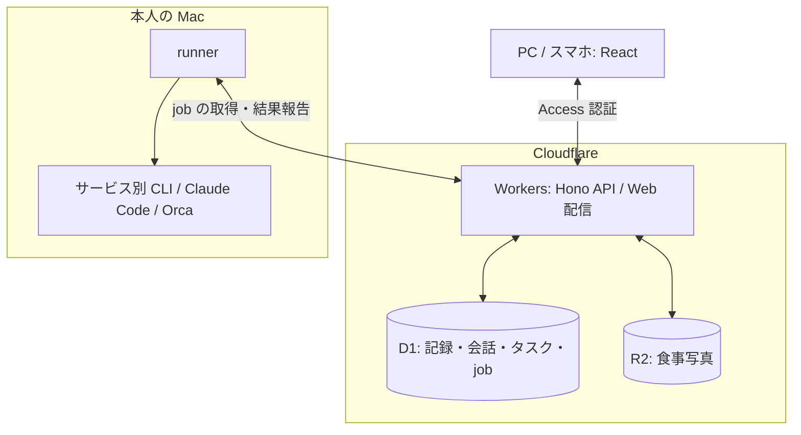

# アーキテクチャ

記録と写真の保存は Cloudflare で完結するため、Mac が止まっていても使えます。外部サービスとの同期や AI の実行は Mac の runner が担当し、各サービスの資格情報をローカルに保持します。

同期・送信・agent 起動は job として処理し、実行経過と結果を Web で確認できます。定期実行は D1 のスケジュールと Cloudflare Cron で管理。runner や外部 CLI の異常・復旧は Web Push で通知します。
